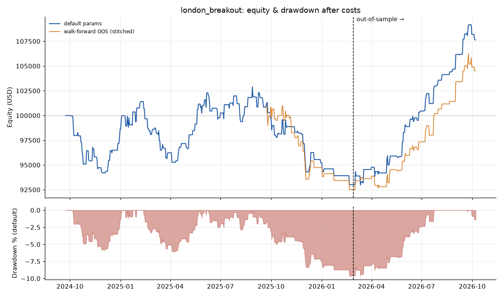
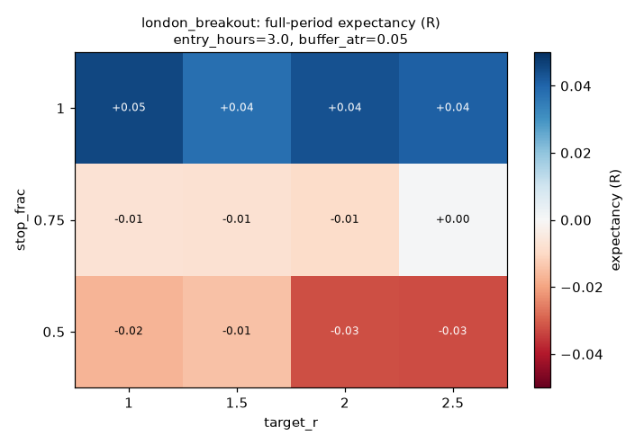
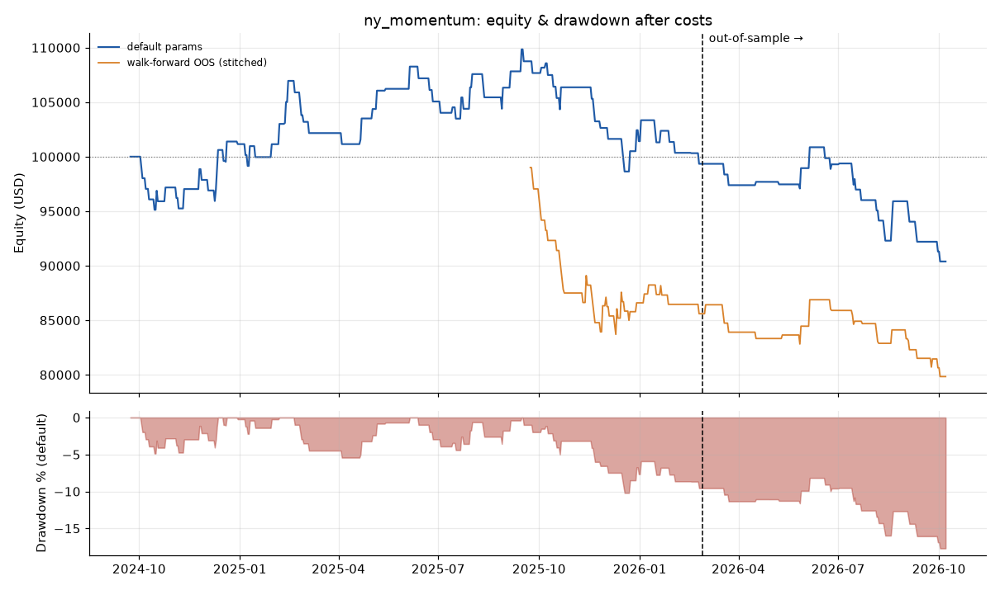
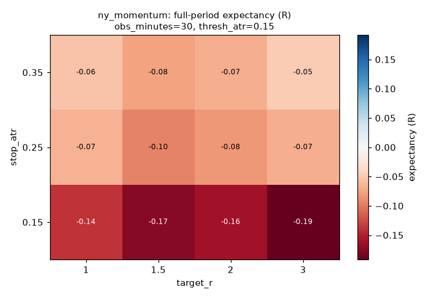
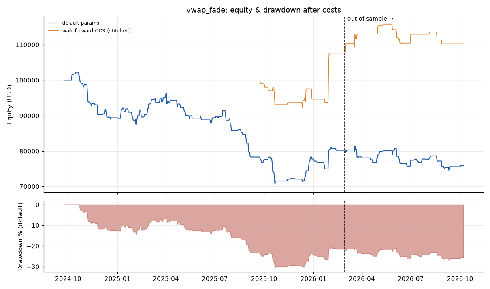
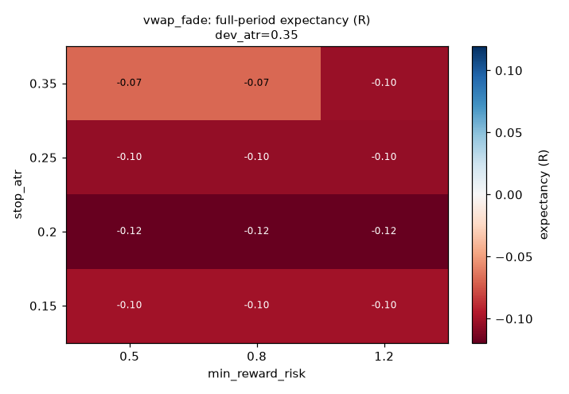

# XAUUSD intraday backtest report

## Verdict

- **london_breakout: INCONCLUSIVE (positive out-of-sample, but not convincing)**
- **ny_momentum: IN-SAMPLE ONLY (does not survive out-of-sample)**
- **vwap_fade: NO EDGE (loses even in-sample after costs)**

Bottom line: none of the three strategies shows an edge that survives costs, out-of-sample data, walk-forward re-optimisation and parameter perturbation. Do not trade them as specified.

Verdict rules (fixed before running): an edge requires positive walk-forward OOS expectancy with t-stat >= 2.0 over >= 30 trades, positive default-parameter OOS expectancy, still positive at 2x spread+slippage, and >= 60% of the parameter grid positive.

## Data

- Source: XAUUSD_M15_2024-09-23_2026-10-07_twelvedata.csv
- Bars: 49,786 x 15-minute, 2024-09-23 00:00:00+00:00 → 2026-10-07 00:00:00+00:00 (UTC)
- Cleaning: 0 duplicates, 0 invalid rows, 10357 weekend rows, 0 spikes removed; 0 OHLC inconsistencies fixed; 21 intraday gaps > 3 bars (not filled — see data_quality.json)
- In-sample: 2024-09-23 → 2026-02-26; out-of-sample: 2026-02-26 → 2026-10-07 (30%)
- Walk-forward: 12-month train / 3-month test, rolling

## Costs and risk (flagged assumptions)

- **Spread: $0.35/oz round trip (conservative default — check your broker)**, x1.5 in Asia, x2 outside main sessions. Bars are treated as mid prices; each fill pays half the spread.
- Slippage: $0.05/oz per side on market and stop fills (none on limit targets).
- Swap: long $-0.60, short $-0.20 per oz per rollover (x3 Wednesdays). All strategies are flat before session end, so swap should never be charged.
- Risk: 1.0% of equity per trade (a clean stop-out = -1R including costs), hard stop on every trade, daily loss limit 3%, max 3 trades/day, flat before session end and before weekends.
- Fill pessimism: stop assumed before target when both are inside one bar; gaps fill at the open.

## london_breakout

**Verdict: INCONCLUSIVE (positive out-of-sample, but not convincing)**

Why:

- walk-forward t-stat >= 2.0 (got 0.67)
- >= 60% of parameter grid positive (got 42%)

Default parameters: `entry_hours=3.0, buffer_atr=0.05, stop_frac=1.0, target_r=1.5, min_range_atr=0.15, max_range_atr=0.8, flat_hour=16.0`  
In-sample optimised: `entry_hours=2, buffer_atr=0.05, stop_frac=1, target_r=1`

| Period | Trades | Win rate | PF | Exp. (R) | t-stat | Return | Max DD | Longest losing streak |
|---|---:|---:|---:|---:|---:|---:|---:|---:|
| Full (default) | 212 | 50.0% | 1.14 | +0.038 | 0.76 | +7.6% | 10.4% | 6 |
| IS (default) | 153 | 42.5% | 0.86 | -0.047 | -0.79 | -7.0% | 9.6% | 6 |
| OOS (default) | 59 | 69.5% | 2.91 | +0.257 | 3.01 | +16.0% | 2.3% | 3 |
| OOS 2x costs | 59 | 69.5% | 2.80 | +0.245 | 2.91 | +15.2% | 2.3% | 3 |
| IS (optimised) | 126 | 48.4% | 1.00 | +0.002 | 0.02 | -0.1% | 7.9% | 5 |
| OOS (optimised) | 45 | 66.7% | 2.66 | +0.239 | 2.74 | +11.0% | 2.2% | 3 |
| Walk-forward OOS | 90 | 55.6% | 1.19 | +0.052 | 0.67 | +4.5% | 9.4% | 4 |

### Walk-forward folds

| Train | Test | Chosen params | Train exp. (R) | Test trades | Test exp. (R) | Test return |
|---|---|---|---:|---:|---:|---:|
| 2024-09-23 -> 2025-09-23 | 2025-09-23 -> 2025-12-22 | entry_hours=3, buffer_atr=0, stop_frac=1, target_r=1 | +0.042 | 38 | -0.144 | -5.3% |
| 2024-12-23 -> 2025-12-23 | 2025-12-23 -> 2026-03-22 | entry_hours=2, buffer_atr=0.05, stop_frac=1, target_r=1 | +0.079 | 7 | -0.168 | -1.2% |
| 2025-03-23 -> 2026-03-23 | 2026-03-23 -> 2026-06-22 | entry_hours=2, buffer_atr=0.05, stop_frac=1, target_r=1 | +0.073 | 20 | +0.170 | +3.4% |
| 2025-06-23 -> 2026-06-23 | 2026-06-23 -> 2026-09-22 | entry_hours=2, buffer_atr=0.05, stop_frac=1, target_r=2 | +0.054 | 18 | +0.453 | +8.2% |
| 2025-09-23 -> 2026-09-23 | 2026-09-23 -> 2026-10-07 | entry_hours=3, buffer_atr=0, stop_frac=1, target_r=2.5 | +0.126 | 7 | -0.032 | -0.2% |

### Parameter sensitivity

42% of 108 parameter combinations have positive full-period expectancy (combos with >= 20 trades). One parameter at a time, others at default (default in bold):

| Parameter | Value | Trades | Exp. (R) | PF |
|---|---:|---:|---:|---:|
| entry_hours | 2 | 171 | +0.052 | 1.19 |
| entry_hours | **3** | 212 | +0.038 | 1.14 |
| entry_hours | 4 | 234 | +0.028 | 1.10 |
| buffer_atr | 0 | 301 | +0.054 | 1.18 |
| buffer_atr | **0.05** | 212 | +0.038 | 1.14 |
| buffer_atr | 0.1 | 152 | -0.029 | 0.90 |
| stop_frac | 0.5 | 212 | -0.015 | 0.97 |
| stop_frac | 0.75 | 212 | -0.008 | 0.98 |
| stop_frac | **1** | 212 | +0.038 | 1.14 |
| target_r | 1 | 212 | +0.045 | 1.17 |
| target_r | **1.5** | 212 | +0.038 | 1.14 |
| target_r | 2 | 212 | +0.044 | 1.16 |
| target_r | 2.5 | 212 | +0.041 | 1.15 |

### Monthly returns (default parameters, full period)

| Year | Jan | Feb | Mar | Apr | May | Jun | Jul | Aug | Sep | Oct | Nov | Dec | Year |
|---|---:|---:|---:|---:|---:|---:|---:|---:|---:|---:|---:|---:|---:|
| 2024 | n/a | n/a | n/a | n/a | n/a | n/a | n/a | n/a | +0.0% | -3.6% | -2.3% | +4.7% | -1.3% |
| 2025 | +2.1% | -2.1% | -2.4% | +0.6% | +4.4% | -1.2% | +1.4% | +0.7% | -2.1% | -0.9% | -1.7% | -2.0% | -3.5% |
| 2026 | -1.4% | -1.0% | +1.7% | +1.5% | +2.5% | +2.2% | +3.1% | +1.1% | +3.4% | -0.5% | n/a | n/a | +13.0% |

## ny_momentum

**Verdict: IN-SAMPLE ONLY (does not survive out-of-sample)**

Why:

- walk-forward expectancy > 0 (got -0.309R)
- walk-forward t-stat >= 2.0 (got -2.27)
- default params OOS expectancy > 0 (got -0.327R)
- OOS still positive at 2x costs (got -0.338R)
- >= 60% of parameter grid positive (got 24%)

Default parameters: `open_hour=8.5, obs_minutes=30, thresh_atr=0.15, stop_atr=0.25, target_r=2.0, flat_hour=16.0`  
In-sample optimised: `obs_minutes=45, thresh_atr=0.2, stop_atr=0.25, target_r=1`

| Period | Trades | Win rate | PF | Exp. (R) | t-stat | Return | Max DD | Longest losing streak |
|---|---:|---:|---:|---:|---:|---:|---:|---:|
| Full (default) | 116 | 36.2% | 0.86 | -0.083 | -0.74 | -9.6% | 18.2% | 8 |
| IS (default) | 87 | 39.1% | 0.99 | -0.001 | -0.01 | -0.7% | 10.7% | 8 |
| OOS (default) | 29 | 27.6% | 0.49 | -0.327 | -1.68 | -9.0% | 10.4% | 6 |
| OOS 2x costs | 29 | 27.6% | 0.47 | -0.338 | -1.76 | -9.4% | 10.6% | 6 |
| IS (optimised) | 79 | 60.8% | 1.45 | +0.171 | 1.67 | +14.0% | 3.7% | 3 |
| OOS (optimised) | 26 | 26.9% | 0.42 | -0.373 | -2.18 | -9.2% | 10.8% | 10 |
| Walk-forward OOS | 72 | 23.6% | 0.52 | -0.309 | -2.27 | -20.2% | 20.2% | 15 |

### Walk-forward folds

| Train | Test | Chosen params | Train exp. (R) | Test trades | Test exp. (R) | Test return |
|---|---|---|---:|---:|---:|---:|
| 2024-09-23 -> 2025-09-23 | 2025-09-23 -> 2025-12-22 | obs_minutes=45, thresh_atr=0.1, stop_atr=0.15, target_r=3 | +0.340 | 34 | -0.474 | -15.0% |
| 2024-12-23 -> 2025-12-23 | 2025-12-23 -> 2026-03-22 | obs_minutes=45, thresh_atr=0.2, stop_atr=0.25, target_r=1 | +0.189 | 12 | -0.022 | -0.3% |
| 2025-03-23 -> 2026-03-23 | 2026-03-23 -> 2026-06-22 | obs_minutes=45, thresh_atr=0.2, stop_atr=0.35, target_r=3 | +0.260 | 7 | +0.377 | +2.5% |
| 2025-06-23 -> 2026-06-23 | 2026-06-23 -> 2026-09-22 | obs_minutes=45, thresh_atr=0.2, stop_atr=0.35, target_r=3 | +0.276 | 15 | -0.431 | -6.2% |
| 2025-09-23 -> 2026-09-23 | 2026-09-23 -> 2026-10-07 | obs_minutes=30, thresh_atr=0.1, stop_atr=0.15, target_r=1 | -0.001 | 4 | -0.516 | -2.1% |

### Parameter sensitivity

24% of 144 parameter combinations have positive full-period expectancy (combos with >= 20 trades). One parameter at a time, others at default (default in bold):

| Parameter | Value | Trades | Exp. (R) | PF |
|---|---:|---:|---:|---:|
| obs_minutes | 15 | 69 | -0.264 | 0.61 |
| obs_minutes | **30** | 116 | -0.083 | 0.86 |
| obs_minutes | 45 | 159 | +0.008 | 1.01 |
| obs_minutes | 60 | 173 | +0.003 | 1.01 |
| thresh_atr | 0.1 | 205 | -0.052 | 0.90 |
| thresh_atr | **0.15** | 116 | -0.083 | 0.86 |
| thresh_atr | 0.2 | 62 | -0.108 | 0.82 |
| stop_atr | 0.15 | 116 | -0.161 | 0.77 |
| stop_atr | **0.25** | 116 | -0.083 | 0.86 |
| stop_atr | 0.35 | 116 | -0.069 | 0.85 |
| target_r | 1 | 116 | -0.066 | 0.86 |
| target_r | 1.5 | 116 | -0.096 | 0.83 |
| target_r | **2** | 116 | -0.083 | 0.86 |
| target_r | 3 | 116 | -0.069 | 0.88 |

### Monthly returns (default parameters, full period)

| Year | Jan | Feb | Mar | Apr | May | Jun | Jul | Aug | Sep | Oct | Nov | Dec | Year |
|---|---:|---:|---:|---:|---:|---:|---:|---:|---:|---:|---:|---:|---:|
| 2024 | n/a | n/a | n/a | n/a | n/a | n/a | n/a | n/a | +0.0% | -2.8% | +0.7% | +3.3% | +1.2% |
| 2025 | -0.0% | +2.0% | -1.0% | +1.3% | +2.6% | -1.1% | +1.2% | -0.0% | +1.3% | -1.2% | -3.5% | -1.2% | +0.3% |
| 2026 | -0.1% | -2.0% | -2.0% | +0.3% | +1.3% | +0.4% | -3.3% | -0.1% | -4.8% | -1.0% | n/a | n/a | -10.9% |

## vwap_fade

**Verdict: NO EDGE (loses even in-sample after costs)**

Why:

- walk-forward t-stat >= 2.0 (got 0.68)
- default params OOS expectancy > 0 (got -0.083R)
- OOS still positive at 2x costs (got -0.098R)
- >= 60% of parameter grid positive (got 0%)

Default parameters: `dev_atr=0.35, stop_atr=0.25, start_hour=10.0, end_hour=14.0, flat_hour=16.0, min_reward_risk=0.8`  
In-sample optimised: `dev_atr=0.55, stop_atr=0.15, min_reward_risk=0.5`

| Period | Trades | Win rate | PF | Exp. (R) | t-stat | Return | Max DD | Longest losing streak |
|---|---:|---:|---:|---:|---:|---:|---:|---:|
| Full (default) | 252 | 39.7% | 0.77 | -0.105 | -1.56 | -24.1% | 31.4% | 11 |
| IS (default) | 187 | 37.4% | 0.75 | -0.112 | -1.40 | -19.8% | 31.4% | 11 |
| OOS (default) | 65 | 46.2% | 0.82 | -0.083 | -0.68 | -5.4% | 9.3% | 4 |
| OOS 2x costs | 65 | 46.2% | 0.79 | -0.098 | -0.82 | -6.3% | 9.9% | 4 |
| IS (optimised) | 87 | 28.7% | 0.88 | -0.052 | -0.26 | -6.0% | 22.6% | 19 |
| OOS (optimised) | 26 | 38.5% | 1.20 | +0.135 | 0.42 | +3.3% | 6.0% | 4 |
| Walk-forward OOS | 56 | 37.5% | 1.28 | +0.199 | 0.68 | +10.2% | 8.2% | 6 |

### Walk-forward folds

| Train | Test | Chosen params | Train exp. (R) | Test trades | Test exp. (R) | Test return |
|---|---|---|---:|---:|---:|---:|
| 2024-09-23 -> 2025-09-23 | 2025-09-23 -> 2025-12-22 | dev_atr=0.55, stop_atr=0.15, min_reward_risk=0.5 | -0.232 | 22 | -0.102 | -2.4% |
| 2024-12-23 -> 2025-12-23 | 2025-12-23 -> 2026-03-22 | dev_atr=0.55, stop_atr=0.15, min_reward_risk=0.5 | -0.149 | 16 | +0.912 | +14.5% |
| 2025-03-23 -> 2026-03-23 | 2026-03-23 -> 2026-06-22 | dev_atr=0.55, stop_atr=0.15, min_reward_risk=0.5 | +0.096 | 13 | -0.086 | -1.2% |
| 2025-06-23 -> 2026-06-23 | 2026-06-23 -> 2026-09-22 | dev_atr=0.55, stop_atr=0.25, min_reward_risk=0.5 | -0.000 | 5 | -0.024 | -0.2% |
| 2025-09-23 -> 2026-09-23 | 2026-09-23 -> 2026-10-07 | dev_atr=0.55, stop_atr=0.25, min_reward_risk=0.5 | +0.164 | 0 | n/a | +0.0% |

### Parameter sensitivity

0% of 60 parameter combinations have positive full-period expectancy (combos with >= 20 trades). One parameter at a time, others at default (default in bold):

| Parameter | Value | Trades | Exp. (R) | PF |
|---|---:|---:|---:|---:|
| dev_atr | 0.25 | 414 | -0.105 | 0.77 |
| dev_atr | 0.3 | 322 | -0.099 | 0.79 |
| dev_atr | **0.35** | 252 | -0.105 | 0.79 |
| dev_atr | 0.45 | 151 | -0.066 | 0.86 |
| dev_atr | 0.55 | 100 | -0.054 | 0.90 |
| stop_atr | 0.15 | 293 | -0.100 | 0.84 |
| stop_atr | 0.2 | 269 | -0.119 | 0.78 |
| stop_atr | **0.25** | 252 | -0.105 | 0.79 |
| stop_atr | 0.35 | 227 | -0.069 | 0.82 |
| min_reward_risk | 0.5 | 252 | -0.105 | 0.79 |
| min_reward_risk | **0.8** | 252 | -0.105 | 0.79 |
| min_reward_risk | 1.2 | 252 | -0.105 | 0.79 |

### Monthly returns (default parameters, full period)

| Year | Jan | Feb | Mar | Apr | May | Jun | Jul | Aug | Sep | Oct | Nov | Dec | Year |
|---|---:|---:|---:|---:|---:|---:|---:|---:|---:|---:|---:|---:|---:|
| 2024 | n/a | n/a | n/a | n/a | n/a | n/a | n/a | n/a | +0.0% | -1.1% | -8.8% | -1.0% | -10.6% |
| 2025 | -0.8% | +5.2% | +2.0% | -3.0% | -3.3% | +0.1% | -2.4% | -5.8% | -5.8% | -7.7% | +0.8% | +7.9% | -13.0% |
| 2026 | +3.4% | -0.2% | -2.7% | -0.1% | +2.7% | -5.4% | +2.6% | -2.6% | -0.1% | +0.5% | n/a | n/a | -2.3% |

## Caveats

- Bar data cannot show the true intrabar path; fills are modelled pessimistically but not exactly.
- Real spreads spike around news (NFP, CPI, FOMC). A flat spread understates that tail cost.
- 2 years is a short sample for intraday gold; a single regime (e.g. a strong trend) can dominate.
- Three strategies x large parameter grids = many implicit tests; a t-stat of 2 is a minimum bar, not proof.
